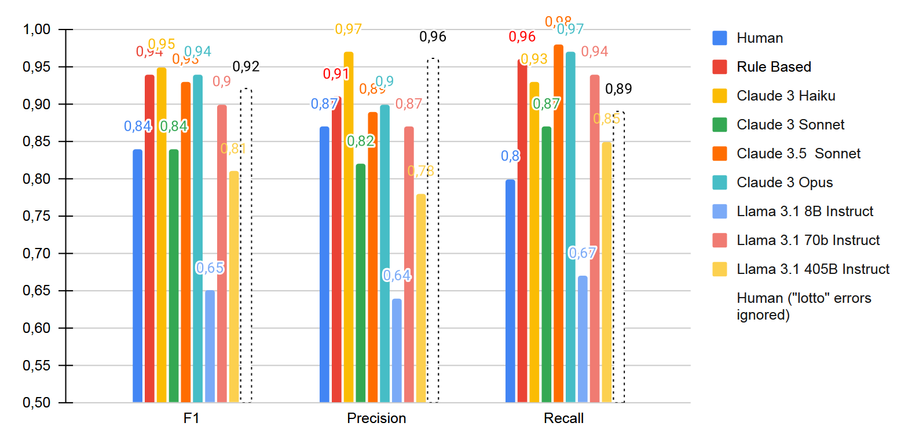
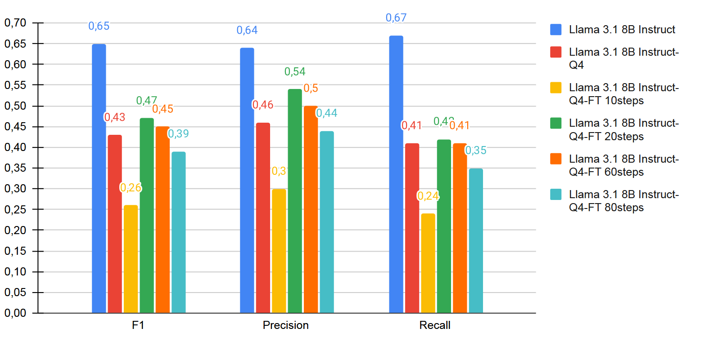
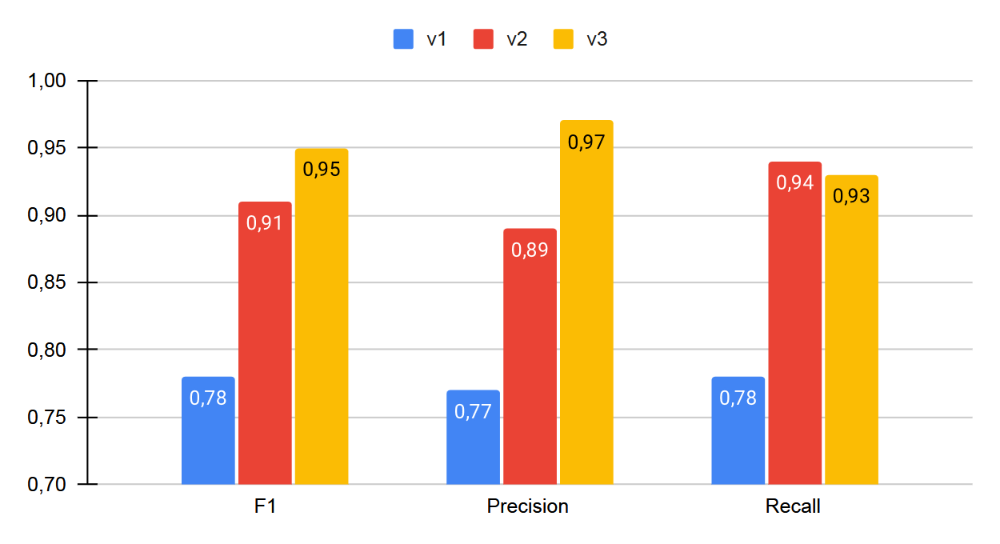
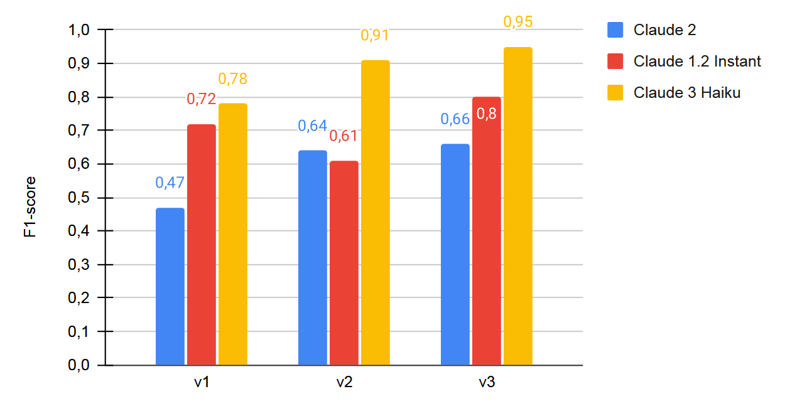
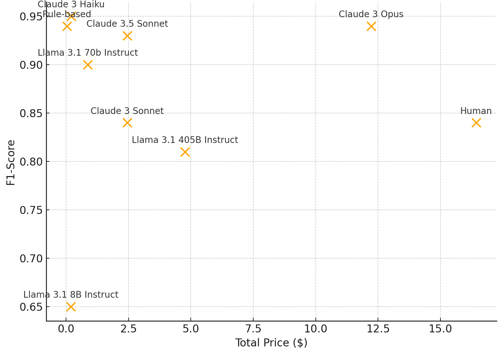

# Estrattore Coordinate Catastali (LLM-based)

Estrae lotto, comune (nome esteso), foglio, particella, sub, tipo immobile


## Invocazione

- Usa lo script invoke.py
- Specifica il nome del modello LLM che desideri utilizzare.
- Specificail testo che vuoi elaborare.

Esempio:

```
python invoke.py --llm "anthropic.claude-3-5-sonnet-20240620-v1:0" --text "Questo è un doc di prova. comune di Milano  lotto 2 foglio 2 particella 5 sub 45."
```

### Output atteso:

```json
{
  "statusCode": 200,
  "body": {
    "ie": {
      "immobili": [
        {
          "comune": "Milano",
          "foglio": "2",
          "particella": "5",
          "sub": "45",
          "tipo_immobile": "fabbricato",
          "lotto": "lotto 2"
        }
      ]
    }
  }
}
```


## Fine Tuning

- cambiare parametri di fine-tuning all'occorrenza
```
..\venv\Scripts\python src\llms_ft.py
```


## Evaluation:
Il processo di evaluation server per valutare le performance tra i diversi modelli disponibili.


### Datasets:
Scaricare dati grezzi, utili per generare i dataset, da [s3://datasinc-nlp-projects/api-coordinate-catastali/](s3://datasinc-nlp-projects/api-coordinate-catastali/)  e salvare in una cartella ./data. I dati grezzi con prefisso "Renzo" sono i samples originali degli annotatori. I dati grezzi con prefisso "sanitezed" sono quelli da me rivisti.

Datasets derivati per evaluation:

- monolotto: circa 150 samples
- multilotto: circa 50 samples
- test_small: 25 samples
- test_medium: 50 samples. Include test_small
- test_full: 150 sameples. Include test_medium
- validation_small: 25 samples
- validation_full: 50 samples. Include validation_small


### Prompts:

Da usare solo con Claude LLMs:

- ie-v1-claude
- ie-v2-claude
- ie-v3-claude

Da usare con Llama LLMs:

- ie-v1-llama
- ie-v2-llama


### Models:

- human (semplicemente legge le annotazioni degli umani e le confronta con quelle corrette da me)
- rules (richiama l'estrattore basato su gramamtica su lambda)
- anthropic.claude-instant-v1
- anthropic.claude-v2
- anthropic.claude-v2:1
- anthropic.claude-3-sonnet-20240229-v1:0
- anthropic.claude-3-haiku-20240307-v1:0
- anthropic.claude-3-opus-20240229-v1:0
- anthropic.claude-3-5-sonnet-20240620-v1:0
- meta.llama3-1-405b-instruct-v1:0
- meta.llama3-1-70b-instruct-v1:0
- meta.llama3-1-8b-instruct-v1:0
- llama3-local (usa un modello llama locale a seconda delle configurazioni in llms_ft.py)
- llama3-local-ft (usa un modello llama locale finetunato a seconda delle configurazioni in llms_ft.py)


### Esegui evaluation
- esempi su come lanciare un'esperimento:
```
..\venv\Scripts\python src\ie.py  --dataset test_small --model anthropic.claude-3-haiku-20240307-v1:0 --ie_prompt ie-v3-claude
..\venv\Scripts\python src\ie.py  --dataset test_small --model meta.llama3-1-70b-instruct-v1:0 --ie_prompt ie-v2-llama
..\venv\Scripts\python src\ie.py  --dataset test_small --model human
..\venv\Scripts\python src\ie.py  --dataset test_small --model rules
```

- Per altri dettagli sui parametri, digitare:
```
..\venv\Scripts\python src\ie.py  --help
```
I risultati sono salvati nella cartella ./results


### Performance


*Performance comparison of LLMs, human annotators and rule-based baseline.*



*Performance of the fine-tuned Llama 3.1 quantized models.*



*Performance improvement in prompt engeneering evaluated on Claude 3 Haiku.*



*Prompt performance across three Claude models, highlighting improvements
over time.*



*Summary plot of the tested models excluding the fine-tuned ones.*